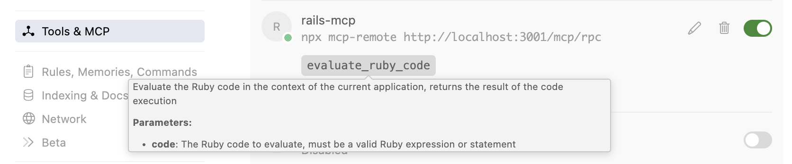

# rack-mcp

A Ruby gem that provides AI assistants with ruby code execution capabilities within the context of existing running application server. Think of it giving AI assistant lighting-speed access to ruby console without the need to write script, reload or restart.

Works with Rails, Sinatra, Hanami, Roda, and any other Rack-based framework. The code is executed in your application's context for debugging and investigation. 


## Use cases

1. Learn a new codebase or code areas quickly. With your AI client and a running server, you can ask it to research while executing snippets from your actual application code. It effectively acts as an in-loop code-verification block.
2. Perform quick, preliminary investigations of customer escalations using a read-only copy of the production environment. It can execute your application code, locate models, and run relevant class methods or code paths from the codebase to do preliminary root-cause analysis (RCA). Even better if your application uses an event-sourcing framework (i.e., change logs). The AI client, together with the code-execution capabilities via rack-mcp, can deliver fast preliminary RCAs.
3. Use it for quick data analytics and export reports as CSV.

## Installation

Add this line to your application's Gemfile:

```ruby
gem "rack_mcp", git: "https://github.com/raja-jamwal/rack-mcp.git"
```

Or install locally for development:

```bash
bundle install
```

## Usage

### Mounting the MCP Server

**Rails** (`config/routes.rb`):
```ruby
require "rack_mcp/mcp/server"

Rails.application.routes.draw do
  mount RackMcp::MCP::Server.new => "/mcp"
end
```

**Rack** (`config.ru`):
```ruby
require "rack_mcp"
require "rack_mcp/mcp/server"

map "/mcp" do
  run RackMcp::MCP::Server.new
end
```

**Sinatra**:
```ruby
require "rack_mcp/mcp/server"

mount RackMcp::MCP::Server.new, at: "/mcp"
```

### Starting the Server

```bash
# Standalone with Rackup
bundle exec rackup -p 9292

# With Rails
bundle exec rails server
```

### Token Authentication

The MCP server requires token-based authentication for all requests. Set the `RACK_MCP_TOKEN` environment variable before starting your server:

```bash
# Set the token
export RACK_MCP_TOKEN="your-secret-token"

# Then start your server
bundle exec rackup -p 9292
```

**Important:** The server will reject all requests without a valid token. Make sure to:
1. Set `RACK_MCP_TOKEN` in your environment before starting the server
2. Include the token as a query parameter (`?token=your-secret-token`) in all MCP client requests

## MCP Protocol

### Endpoint

The MCP server exposes a single JSON-RPC endpoint:

- **POST /mcp/rpc** - JSON-RPC request and response

### Available Tools

**evaluate_ruby_code**
- Description: Evaluates Ruby code and returns the result with captured stdout/stderr
- Parameters:
  - `code` (string, required): Ruby code to execute

## Connecting AI Assistants

### Cursor/ Claude Desktop

Add to your MCP client configuration (`.cursor/mcp.json` for Cursor or `claude_desktop_config.json` for Claude Desktop):

```json
{
  "mcpServers": {
    "rails-mcp": {
      "command": "npx",
      "args": [
        "mcp-remote",
        "http://localhost:3001/mcp/rpc?token=your-secret-token"
      ]
    }
  }
}
```

**Note:** Replace `your-secret-token` with the same token you set in the `RACK_MCP_TOKEN` environment variable on your server. The token must be included as a query parameter in the URL.



### Other MCP Clients

Any MCP-compatible client can connect to the server by making JSON-RPC requests to the `/mcp/rpc?token=your-secret-token` endpoint.

Example with curl:

```bash
curl -X POST "http://localhost:3001/mcp/rpc?token=your-secret-token" \
  -H "Content-Type: application/json" \
  -d '{
    "jsonrpc": "2.0",
    "id": 1,
    "method": "tools/list"
  }'
```

## Testing

Run the test suite:

```bash
bundle exec rspec
```

## Security Warning

⚠️ **This gem executes arbitrary Ruby code.** 

**Important security considerations:**
- **Token Authentication Required:** The server requires a token for all requests. Set `RACK_MCP_TOKEN` environment variable and include it in all client requests
- Only use in development environments or secure, isolated production environments
- Use a strong, randomly-generated token (e.g., `openssl rand -hex 32`)
- Never commit tokens to version control
- Rotate tokens regularly
- Consider running in a sandboxed or containerized environment
- Use network-level restrictions (firewall, VPC) to limit access
- Monitor and log all code execution requests

## Concurrency Note

This gem uses global `$stdout/$stderr` redirection during evaluation, which can clash in multi-threaded servers. For production use with concurrency, consider:
- Running in a single worker/thread mode
- Isolating evaluation per request (e.g., via `fork`)
- Using a dedicated job worker for code execution

## License

MIT License - see LICENSE file for details.

